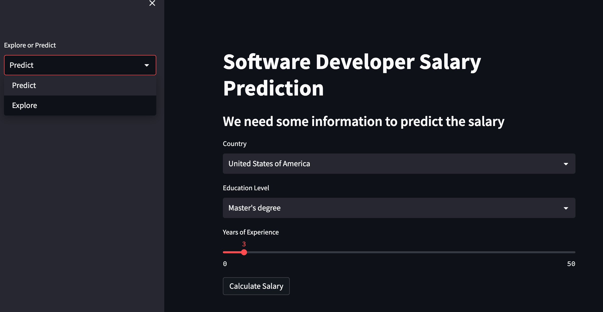

# Pix2Pix GAN for Image-to-Image Translation

The Pix2Pix Generative Adversarial Network, or GAN, is an approach to training a deep convolutional neural network for image-to-image translation tasks.

## Technologies

| Technology   | Description                                                               |
|--------------|---------------------------------------------------------------------------|
| Python       | An interpreted, high-level programming language used for general-purpose programming. |
| Keras        | An open-source Python library used to build interactive web applications. |
| NumPy        | A popular Python library used for scientific computing and working with arrays. |


## Demo
A demo of this application is available on Streamlit - [DevPay](https://ajosegun-devpay.streamlit.app/)




## Features
Average salary calculation based on various factors such as years of experience, job title, country, and programming language.

Visualization of the data using interactive plots that can be filtered based on the above factors.

Machine learning models to predict salary based on the user-specified factors.

## Requirements
Python 3.6 or higher
Streamlit
Pandas
Numpy
Matplotlib
Seaborn
Sklearn

## Installation
To install the required packages, run the following command:

```
pip install -r requirements.txt
```

## Usage
To run the application, navigate to the root directory of the project in the terminal and run the following command:

```
streamlit run app.py
```

This will start the application and launch a local server at http://localhost:8501/ in your web browser.

## Conclusion
DevPay is an easy-to-use machine learning web application that provides valuable insights into software developer salaries. With its user-friendly interface and powerful machine learning models, it is a valuable tool for anyone interested in exploring the data from the Stack Overflow Annual Developer Survey 2022.


